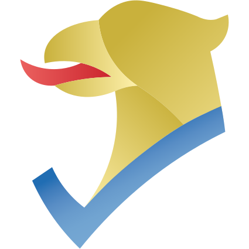

# Coretôr Ortografic Furlan

[Friulano](fur.md) | [Italiano](ita.md)

<div id="top"></div>

[![Contributors][contributors-shield]][contributors-url]
[![Forks][forks-shield]][forks-url]
[![Stargazers][stars-shield]][stars-url]
[![Issues][issues-shield]][issues-url]
[![GPL-3.0 License][license-shield]][license-url]

<br />
<div align="center">
  <a href="https://github.com/daurmax/CoretorOrtograficFurlan-Core">
    
  </a>
  <h1 align="center"><b>Coretôr Ortografic Furlan</b></h1>

  <p align="center">
    <i>Coretôr Ortografic Furlan</i> (<b>COF</b>) is a multimodal, cross platform spell-checker for the Friulian language.
    <br />
    <a href="https://github.com/daurmax/CoretorOrtograficFurlan-Core"><strong>Explore the docs »</strong></a>
    <br />
    <a href="https://github.com/daurmax/CoretorOrtograficFurlan-Core/issues">Report a bug</a>
  </p>
</div>

<details>
  <summary>Table of contents</summary>
  <ol>
    <li>
      <a href="#about-the-project">About COF</a>
      <ul>
        <li><a href="#built-with">Built with</a></li>
      </ul>
    </li>
    <li>
      <a href="#getting-started">Getting started</a>
      <ul>
        <li><a href="#prerequisites">Prerequisites</a></li>
        <li><a href="#installation">Installation</a></li>
      </ul>
    </li>
    <li><a href="#contributing">Contributing</a></li>
    <li><a href="#license">License</a></li>
    <li><a href="#contact">Contact</a></li>
    <li><a href="#acknowledgments">Acknowledgments</a></li>
  </ol>
</details>

## About COF

<p align="right">(<a href="#top">back to top</a>)</p>

### Built with

* [![.NET][.NET]][.NET-url]
* [![C#][C#]][C#-url]
* [![SQLite][SQLite]][SQLite-url]

<p align="right">(<a href="#top">back to top</a>)</p>

## Getting started

This section provides basic instructions to set up the project locally.

### Prerequisites

* .NET 6 or higher

### Installation

1. Clone the repository
   ```bash
   git clone https://github.com/daurmax/CoretorOrtograficFurlan-Core.git
   ```
2. Build and run the API
   ```bash
   cd API/ARLeF.CoretorOrtografic.API
   dotnet restore
   dotnet run
   ```

<p align="right">(<a href="#top">back to top</a>)</p>


## Contributing

Contributions are welcome and encouraged.
1. Fork the project
2. Create your feature branch (`git checkout -b feature/AmazingFeature`)
3. Commit your changes (`git commit -m 'Add some Feature'`)
4. Push to the branch (`git push origin feature/AmazingFeature`)
5. Open a Pull Request

<p align="right">(<a href="#top">back to top</a>)</p>

## License

Distributed under the GPL-3.0 License. See `LICENSE` for more information.

<p align="right">(<a href="#top">back to top</a>)</p>

## Contact

Please open an issue on GitHub for any request.

Project Link: <https://github.com/daurmax/CoretorOrtograficFurlan-Core>

<p align="right">(<a href="#top">back to top</a>)</p>

## Acknowledgments

* Thanks to everyone contributing to the project.

<p align="right">(<a href="#top">back to top</a>)</p>

[contributors-shield]: https://img.shields.io/github/contributors/daurmax/CoretorOrtograficFurlan-Core.svg?style=for-the-badge
[contributors-url]: https://github.com/daurmax/CoretorOrtograficFurlan-Core/graphs/contributors
[forks-shield]: https://img.shields.io/github/forks/daurmax/CoretorOrtograficFurlan-Core.svg?style=for-the-badge
[forks-url]: https://github.com/daurmax/CoretorOrtograficFurlan-Core/network/members
[stars-shield]: https://img.shields.io/github/stars/daurmax/CoretorOrtograficFurlan-Core.svg?style=for-the-badge
[stars-url]: https://github.com/daurmax/CoretorOrtograficFurlan-Core/stargazers
[issues-shield]: https://img.shields.io/github/issues/daurmax/CoretorOrtograficFurlan-Core.svg?style=for-the-badge
[issues-url]: https://github.com/daurmax/CoretorOrtograficFurlan-Core/issues
[license-shield]: https://img.shields.io/github/license/daurmax/CoretorOrtograficFurlan-Core.svg?style=for-the-badge
[license-url]: https://github.com/daurmax/CoretorOrtograficFurlan-Core/blob/main/LICENSE
[.NET]: https://img.shields.io/badge/.NET-5C2D91?style=for-the-badge&logo=.net&logoColor=white
[.NET-url]: https://dotnet.microsoft.com/
[C#]: https://img.shields.io/badge/c%23-%23239120.svg?style=for-the-badge&logo=c-sharp&logoColor=white
[C#-url]: https://docs.microsoft.com/en-us/dotnet/csharp/
[SQLite]: https://img.shields.io/badge/sqlite-%2307405e.svg?style=for-the-badge&logo=sqlite&logoColor=white
[SQLite-url]: https://www.sqlite.org/
